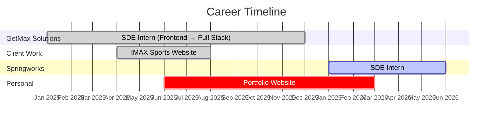

<!-- ══════════════════════════════════════════════════════════════════════ -->
<!-- 🎯 MIX OF PLAYFUL + PROFESSIONAL 🎯 -->
<!-- ══════════════════════════════════════════════════════════════════════ -->

 

 

### 👨‍💻 `whoami`

> _I'm a Full Stack Developer who started as a frontend enthusiast and evolved into someone who loves building end-to-end products. I've spent the last year shipping real websites for real businesses, and I'm not stopping anytime soon._

 

📌 <b>Quick Facts</b> (click to expand)

 

- 🏢 **Currently:** SDE Intern at **Springworks** _(Jan 2026 — Present)_
- 🏗️ **Previously:** SDE Intern at **GetMax Solutions** _(Jan 2025 — Dec 2025)_
- 🎯 **Journey:** Frontend Developer → Full Stack Developer
- 🌐 **Shipped:** 3+ production websites
- 👤 **Fun fact:** I'm credited on the [GetMax Healthcare team page](https://www.getmaxhealthcare.com)!
- ☕ **Fuel:** Chai + Lo-Fi beats

 

 

## 🗺️ My Journey So Far

 

<table>
<tr>

<td width="50%" valign="top">

### 🟢 Springworks — _Current_
**SDE Intern** &nbsp;`Jan 2026 — Present`

Actively building production features, pushing PRs, and contributing to the core product. Shipping code daily and collaborating with the engineering team.

</td>

<td width="50%" valign="top">

### 🔵 GetMax Solutions
**SDE Intern** &nbsp;`Jan 2025 — Dec 2025`

My first professional home — where I grew from a frontend developer into a confident full stack engineer over 12 incredible months.

**Key highlights:**
- 🌐 Built [getmaxhealthcare.com](https://www.getmaxhealthcare.com) — the official website
- 🎨 Owned the entire frontend architecture
- 📈 Transitioned to full stack development
- 👤 Featured on the company's Team Page
- 🤝 Delivered [IMAX Sports](https://imaxsports.com) for an external client

</td>

</tr>
</table>

 

 

## 🚀 Projects in the Wild

| &nbsp; | Project | What I Did | Link |
|:------:|:--------|:-----------|:----:|
| 🏥 | **GetMax Healthcare** | Built the entire frontend + full stack features for the official company website | [Visit →](https://www.getmaxhealthcare.com) |
| 🏏 | **IMAX Sports** | Designed & developed a client-facing website from scratch | [Visit →](https://imaxsports.com) |
| 🎨 | **Personal Portfolio** | My personal space to showcase everything I've built | _Coming Soon_ |

 

 

## 🛠️ Tech I Work With

| Category | Technologies |
|:--------:|:-------------|
| **Languages** |     |
| **Frontend** |    |
| **Backend** |   |
| **Databases** |   |
| **Tools** |      |

 

 

## 📊 The Numbers

 

 

 

## 🤝 Let's Connect!

_I'm always excited to meet fellow developers, collaborate on projects, or just chat about tech._

 

 

⭐ **If you find my work interesting, consider giving my repos a star!**

 

 

_"First, solve the problem. Then, write the code."_ — John Johnson

